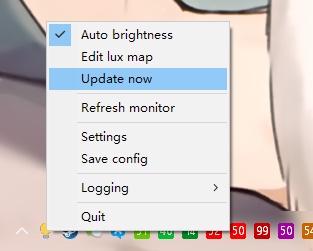
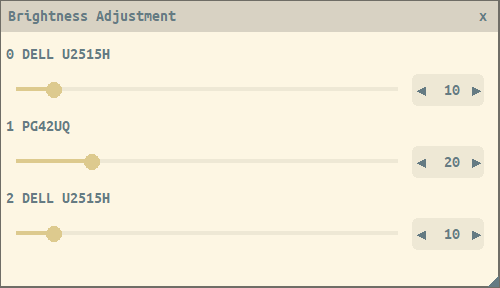
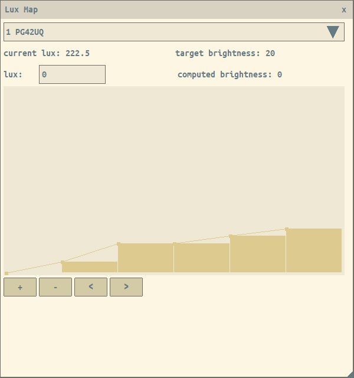

## AUTO-BRIGHTNESS

A little utility to control PC monitor brightness automatically by ambient light.

### Requirement

Monitors that support DCC/CI, currently using high level APIs provided by Windows to control brightness.

Source of following external components are provided in `3rdparty`.

- light sensor connected to arudino board (`sensorhub.ino`)
- sensor prometheus metrics server (`sensor-hub`)
  - fetching sensor data via serial port from arudino board

### Build

Build with msys2 and cmake.